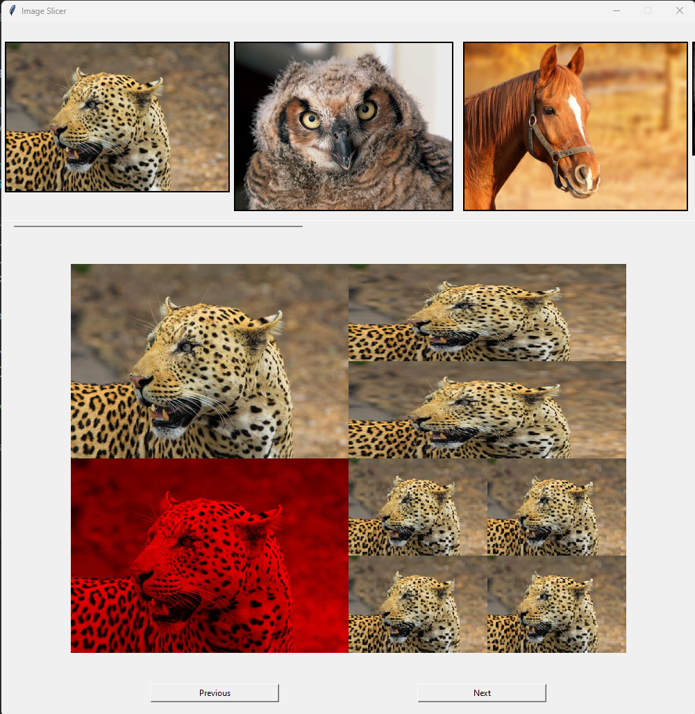

# Image Processing Application

This Image Processing Application is designed as an educational project to explore and learn
Python programming, with a particular focus on leveraging the NumPy library. The application
processes images stored in a designated 'images' directory, supporting formats such as .jpg,
.jpeg, .png, and .bmp.

The core functionality involves applying four distinct processing techniques to each image,
showcasing the versatility and power of NumPy arrays in image manipulation. These processed
images are then displayed in simple user-friendly GUI built using tkinter, offering a
straightforward and interactive way to view the results. The application's architecture
is deliberately structured to facilitate easy expansion, allowing for the addition of more
processing methods without significant restructuring.

## Key Features:
- **Image Support:** Handles multiple image formats including .jpg, .jpeg, .png, and .bmp.
- **NumPy Integration:** Utilizes NumPy for efficient image processing and manipulation.
- **Multiple Processing Techniques:** Applies four different processing techniques to each
image, demonstrating various aspects of image manipulation.
- **Expandable Structure:** Designed with scalability in mind, making it simple to introduce
additional processing methods.
- **Tkinter GUI:** Features a simple yet effective graphical user interface for displaying
processed images, enhancing user interaction.

## Compliance with Practical Task 2 (P2) Requirements

### Basic Features:

- **Vertical and Horizontal Slicing:** Implements slicing of images into 20-200 slices using
NumPy, rearranging slices by alternating odds and evens.
- **Image Rotation:** Provides functionality to rotate images using NumPy array manipulation.
- **Image Concatenation:** Adjusts and concatenates multiple image arrays into a single image
using vstack and hstack.

### Additional Features:

- **Color Filters:** Converts RGB images to grayscale, red, green, or blue using NumPy.
- **RGBA Handling:** Removes the alpha channel from RGBA images to ensure compatibility
with formats like JPEG.
- **Testing:** Includes NumPy-based sample tests to validate image processing functions.

## Installation Instructions

Follow these steps to set up the application locally:

1. Ensure you have Python 3.10 installed on your system. You can download it from
[Python's official website](https://www.python.org/downloads/).
1. Download the project from its [GitHub repository](https://github.com/Tomas4python/image_slicing)
and extract it into for project created new folder or alternatively if you are GIT user:
   - Open **Command Prompt** or **PowerShell** on your Windows system.
   - Navigate to the project folder using the '**cd**' command. For example:
   ```
   cd path\to\project\folder
   ``` 
   - clone the entire project into project folder by running the script:
   ```
   git clone "https://github.com/Tomas4python/image_slicing.git"
   ```
   
1. Set Up a Virtual Environment:
   - It's recommended to use a virtual environment to avoid conflicts with
   other Python projects or system-wide packages.
   - Navigate to the project folder.
   - Create a new virtual environment named 'venv' in the project directory by running the script:

   ```
   python -m venv venv
   ```

   - Activate the virtual environment:

   ```
   .\venv\Scripts\activate
   ```

1. Install Dependencies:
   - Execute in the project folder and active venv the following command to install all required dependencies:

   ```
    pip install -r requirements.txt
   ```

   This command will use pip, the Python package installer, to install all the libraries
listed in the requirements.txt file.

By following these steps, you'll have a clean and isolated Python environment for running
and testing this project.

## Launching the Application

### Standard Launch:

Navigate to the project folder and activate venv (Step 3 of 'Installation Instructions'). 
Run the application by executing:
```
python src\main.py
```
### Alternative Launch
```
.\run.bat
```
### Launch With Command Line Arguments:
You can provide up to two optional arguments in command line - number of slices (20-200)
and colour filter (red, green, blue, gray) for example:
```
python src\main.py 200 red
```
or

```
python src\main.py blue 50
```

## Usage
Store your images in the **images\\** directory and launch the Application to view the image
processing results in the graphical user interface. The **images\\** directory currently contains
8 sample images, which you can retain or remove as desired. The Application supports .jpg,
.jpeg, .png, and .bmp image formats with a resolution of at least 640x480.

   

